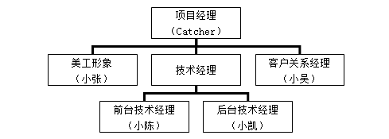
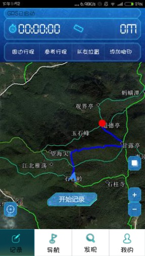

# Medium_12_lvtu

# 关于
## “驴途”驴行资源共享系统

宁波大红鹰学院 幺零先锋

指导教师：何广军

**一、目标问题**

“驴行”（即户外徒步）已经成为目前最受热捧、经济的健身项目之一。各级政府也倡导国民积极开展日常健身活动。然而，近年来，全国各地多次发生驴行者山中迷路事件，户外徒步的安全性逐渐成为公共出行安全问题。

户外徒步运动需要解决的主要问题有：

1.有不少户外徒步旅行者因对周边徒步线路不清楚，存在盲目徒步现象。

2.已有驴行的行程和路线一般无法获取或者分享。

3.户外徒步运动团体之间缺乏良好的共享信息机制。

目前的导航软件局限于城区道路，为此，需要一款户外徒步共享辅助系统，为广大驴行者的安全出行保驾护航。

**二、解决思路**

1.线路记录。拟设计一个“路线记录功能”以记录用户在这条道路上走过的轨迹。记录之后可以选择分享，或者保存到自己的路径。

2.线路分享。记录路线后，可选择保存到自己目录，或者分享这条路线。

3.线路规划。户外徒步运动者在一个陌生的徒步环境时，可以通过查看半径1公里范围内网友留下的路线，规划自己的徒步路线。

**三、实现过程**

1、管理

本系统开发人员组织团队成员如下图所示。

2、技术

“驴途”驴行资源共享系统的总体设计框架如下图所示。

本系统为用户提供了一套可靠、简单、易学习和使用的UI界面。每个功能基本会有一个View页面相对应，对页面的维护也容易。

本系统主要有线路（Line）、轨迹(Track)、位置点(Point)、导航（Navigation）、照片（Photo）、用户（User）等6个实体类。

一位用户(User)可以分享多条徒步运动轨迹(Track)，一条轨迹可以依据点的重合情况分割为多条线路(Line)，一条线路由多个点(Point)组成，规划出的一条导航路径(Navigation)由多条线路组成。一个点可以对应有多个照片。

3、文化

本团队致力于为户外徒步者提供更好、更精确的导航服务，为广大驴行者的安全出行保驾护航。同时提供徒步者在驴行过程中分享自己路线的功能，将自己看到的景色分享给他人。

**不一样的路线，不一样的风景！驴途，帮您发现身边不一样的景色！**

4、团队协作过程

项目的开发过程虽然辛苦，但团队成员能相互配合，协同作战。在解决每一个实际问题中寻找到快乐，在感悟中得到升华。我们每一个人自始至终都在为自己能跨越所面对的难关而满足，为同伴成功而欢呼。所有的一切，是那么真切，是那么具有合力。在整个项目开发完成后，尽管大家都很累，可每个人都兴高采烈地议论着项目中的事情，都感到回味无穷。于是，我们快乐着，我们幸福着。

**四、本作品的主要特色**

1、GPS轨迹共享

用户记录的GPS轨迹可以共享，或者自己保存。为他人提供自己GPS路线的信息，各种属性。比如，平均速度、总路程等。

2、道路分类标记 

对于山间不同道路，用以不同颜色的轨迹表示。例如，用浅绿色表示古道，墨绿色表示官方标准步道，黄色表示山中小道等。

3、驴途线路规划

长按目的地，弹出子菜单，点击“设终点”，手机GSP获取用户的当前位置，利用已有的共享轨迹为用户规划路线，并开始为用户导航。

